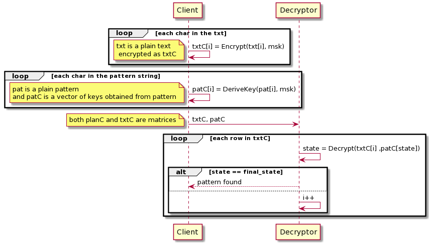

# pattern matching with functional encryption

This project develops an example of pattern matching with functional encryption. A finite automata is employed as algorithm for pattern searching.
A client encrypts pattern and text and sends out to the decryptor the crypted information. Then it ouputs the matches and send back them to the client.

The adopted schema is [FHIPE](https://eprint.iacr.org/2016/440.pdf) (Function Hiding Inner Product Encryption), since it permits of encrpypting both text and pattern. 
The functional encryption library is [Gofe](https://github.com/fentec-project/gofe).

## Diagram

 

## Files
- PatternMatching.py it is a workaround file for creating matrices of text and pattern that are used by the functional encryption application. 
- PatternMatching.go: it contains the FHIPE schema, retrieves pattern and text matrices for the encryption and decryption task.   

## ISSUES
- With the current inner product encrption schema encryption and decryption time is too slow for long texts. Possible Solutions : - Check if other solutions exist in letterature in searchable encryption field, optimize/replace the current pattern searching algorithm, like with a suffix tree or try with another inner product schema.  

